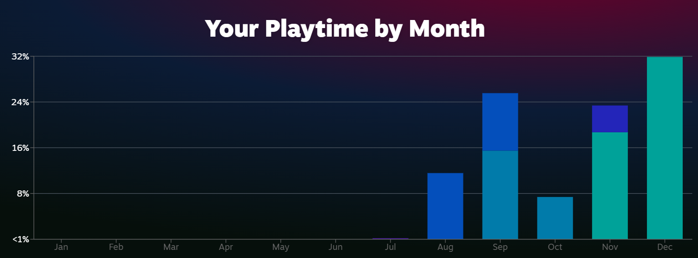

# 润到新加坡

我是 22 年 7 月搬到新加坡🇸🇬的，因为有很多好奇和担心，在来之前就非常想多了解一下新加坡的方方面面，可惜当时搜到的信息都比较零散。在搜集信息的时候，就想着把自己了解到的分享出来，结果就一直鸽…责任全在 steam🤣

<figure><figcaption></figcaption></figure>

23 年了，给自己立个 🚩，完善一下这个分享。本来想在GitHub()写的，受到 Kelvin 大佬的 [run2.sg](http://run2.sg/) 启发，~~转到编辑方便的 notion。~~本页面纯 0 元购，用的 notion 和 cloudflare 的免费套餐，~~在~~ [~~fruitionsite~~](https://fruitionsite.com/) ~~的指导下配置了域名转发~~，域名也是花的之前免费薅的腾讯云代金券😋&#x20;

update：结果配置的notion域名转发worker被谷歌判断欺诈网站，又转来现在的自带自定义域名的 gitbook。

### 总体感受

先给一个总体感受吧，坡县确实不是天堂，一定要有吸引你的点，过来才待得住。至于什么点能吸引到你，就见仁见智了。

* 工作
  * 工资：总包跟国内差不多，高级岗可能还比不过国内，但时薪完爆；一般13最多14薪，跟国内夸张年终没法比
  * 机会：金融企业多，国际大厂的在这的研发岗位比较少；比不了国内，但各种亚太总部，研发岗位还是相对较多
  * 假期：法定假日跟国内一样11天，但不会调休，碰到周末也会顺延放假；年假一般十几二十天，没有不敢休假的风气
  * 失业：法定上没有国内的n+1，提前2周通知就可以；但好一点的公司还是会配上类似n+1
* 福利：
  * 税：税少，一般比例个位数
  * 保险：没身份就没有CPF（社保公积金），看病贵，一定要自己买保险；
  * 补贴：政府会发各种补贴，虽然数量少，但是心意到了
* 住房：
  * 买房：公寓房价跟深圳差不多，新移民基本不用考虑政府组屋了
  * 租房：房租贵，近期疯涨，可能是国内的2-3倍甚至更高；但是租售同权，学区一样，一样领政府水电补贴
* 吃饭：
  * 价格：一般会感觉降级了，最基本的食阁一般5-15新，但不会吃得开心；随便下个简单馆子，人均50新起步，稍稍吃好一点人均100新以上；
  * 种类：商场里的餐厅跟国内一线城市差不多；日常中广东福建的很普遍，东北四川的在china town比较多，东南亚和油炸西餐基本食阁都有。
  * 做饭：感觉不鼓励做饭，抽油烟机不许排气到屋外的，基本都是内循环
  * 外卖：快递费可能比饭贵，也有做活动的时候
  * 烟酒：税很重，国内几倍，一般都要免税店带酒回来
* 购物：
  * 超市：物价比国内贵，很多就同样价格，换个币种；有华超，国内调料零食都买得到
  * 网购：本地网购价格是国内几倍，快递1周；淘宝便宜，但种类有限，海运1个月左右，空运2天+本地快递1周；
  * 商场：没啥好逛的😅

### 参考

最后列下其它很好的参考，希望能在大佬们的分享上做一些补充

* [从国内跳槽至新加坡工作的经验分享](https://wsgzao.github.io/post/singapore/)
* [run2.sg](http://run2.sg/)，.sg 后缀的更纯正😂
