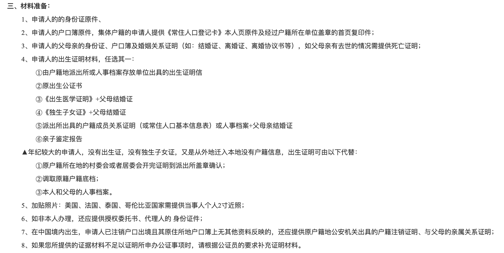

# 🆔 身份

[飘过新加坡的日子 – 搬家地址变更 (Change of Residential Address)](https://www.kuact.com/post/2017-01-03-%E9%A3%98%E8%BF%87%E6%96%B0%E5%8A%A0%E5%9D%A1%E7%9A%84%E6%97%A5%E5%AD%90-%E6%90%AC%E5%AE%B6%E5%9C%B0%E5%9D%80%E5%8F%98%E6%9B%B4-change-of-residential-address/)

## PR

[飘过新加坡的日子 – 申请PR之后 (2021版)](https://www.kuact.com/post/2021-11-12---%E9%A3%98%E8%BF%87%E6%96%B0%E5%8A%A0%E5%9D%A1%E7%9A%84%E6%97%A5%E5%AD%90-%E7%94%B3%E8%AF%B7pr%E4%B9%8B%E5%90%8E/)

### 出生公证

96前出生的，没有出生证，要去公证处办“出生公证”，可以直接网上搜各地的公证处

推荐这个 [公证云](https://www.egongzheng.com/) 网站，虽然不知道是不是官方的，但是可以通过这个网站联系上当地的公证员，详细了解需要的材料。

<figure><figcaption></figcaption></figure>

## 公民

[飘过新加坡的日子 - 入籍三部曲（一）：退籍与宣誓](https://www.kuact.com/post/2020-08-17---%E9%A3%98%E8%BF%87%E6%96%B0%E5%8A%A0%E5%9D%A1%E7%9A%84%E6%97%A5%E5%AD%90---%E5%85%A5%E7%B1%8D%E4%B8%89%E9%83%A8%E6%9B%B2%E4%B8%80%E9%80%80%E7%B1%8D%E4%B8%8E%E5%AE%A3%E8%AA%93-/)

[飘过新加坡的日子 - 入籍三部曲（二）：委托书；同一人公证和认证，证明我是我](https://www.kuact.com/post/2020-08-18---%E9%A3%98%E8%BF%87%E6%96%B0%E5%8A%A0%E5%9D%A1%E7%9A%84%E6%97%A5%E5%AD%90---%E5%85%A5%E7%B1%8D%E4%B8%89%E9%83%A8%E6%9B%B2%E4%BA%8C%E5%A7%94%E6%89%98%E4%B9%A6%E5%90%8C%E4%B8%80%E4%BA%BA%E5%85%AC%E8%AF%81%E5%92%8C%E8%AE%A4%E8%AF%81%E8%AF%81%E6%98%8E%E6%88%91%E6%98%AF%E6%88%91/)

